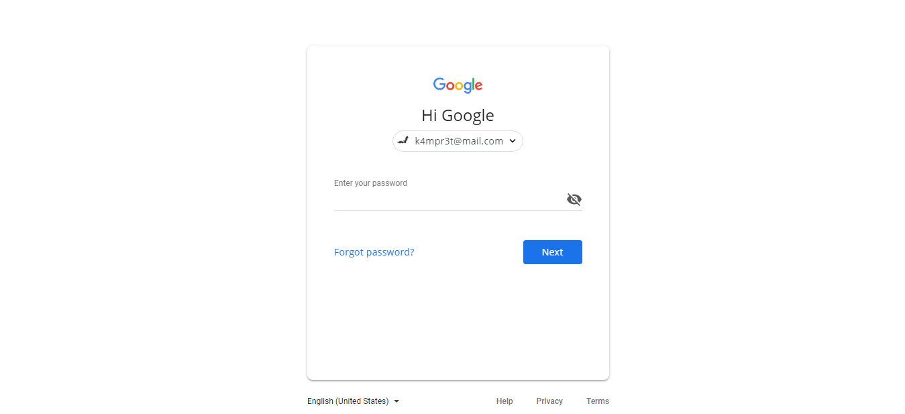

# Gmail Phishing #

signin.php?name={specific user}&email={specific email}&image={specific url icon image}

## Use Parameter ## 

name  : specific user

email : specific email

image : specific url icon image

